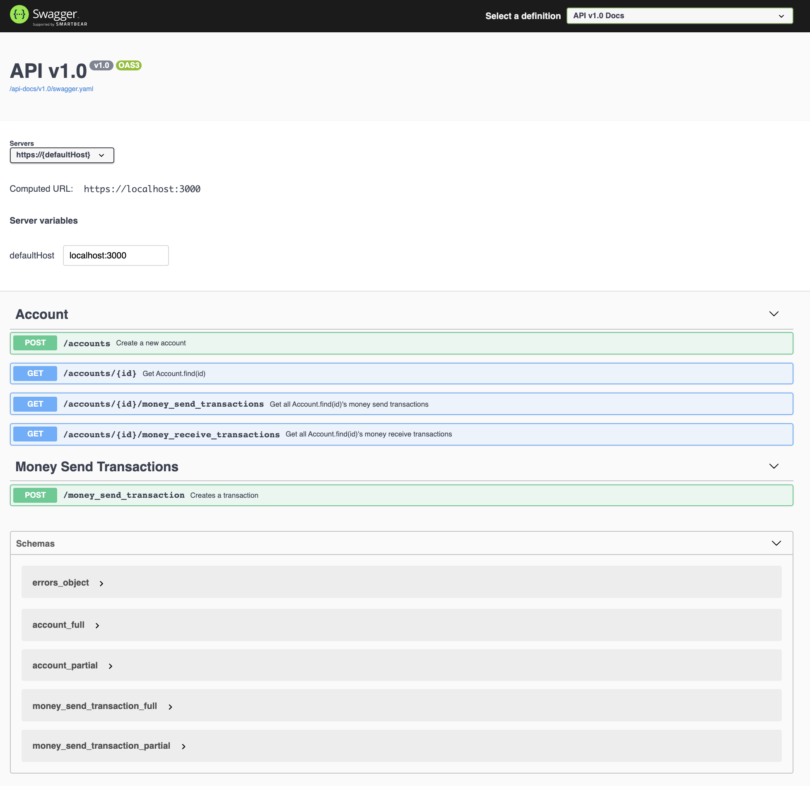

# Simple Payments API
A simple payments API where users can create accounts, send/receive money, get money added/subtracted from their account's balance, and see sent/received transactions.

## Requirements
- Ruby version `2.7.2` (manage Ruby versions with [rvm](https://rvm.io/) or [rbenv](https://github.com/rbenv/rbenv))
- PostgreSQL (or just Docker if you're going to install and use the app using it (Docker))

## Features:
- :gem: Versioned gems
  - All gems have MAJOR and MINOR versions specified
    - This way we don't automatically pull breaking changes on `bundle update`
- :memo: Versioned API
  - Semantic versioning with MAJOR and MINOR versions specified for endpoints
    - PATCH is not specified because users don't need to change versions for bug fixes. They (bug fixes) can be assumed to happen in the background via ticket resolutions.
  - Read more about semantic versioning [here](https://semver.org/)
- :page_with_curl: [OpenAPI](https://swagger.io/specification/) compliant endpoints
  - All API endpoints have OpenAPI specs
  - UI viewable at http://localhost:3000/api-docs
  - YAML file viewable at `swagger/v1.0/swagger.yaml`
  - If you change any specs (at `spec/requests`), make sure you run `rails rswag:specs:swaggerize ` after
  - To generate a controller spec file, run `rails generate rspec:swagger API::v1.0::MyController` (replacing `MyController` with the target controller name)
- :heavy_check_mark: Integration tests
  - All API endpoints have integration tests
  - Other data type validation and resposne code matching tests are added in `spec/requests/api/v1.0/accounts_spec.rb` and in `spec/requests/api/v1.0/money_send_transactions_controller_spec.rb` by utilizing the `rswag` gem test suite.
  - (Total number of tests: 53)
- :whale: Dockerized

(OpenAPI UI. Available at http://localhost:3000/api-docs) 

## Run
Setup and run server
- Traditional/local way
  1. `rails db:create db:migrate`
  2. `bundle install`
  3. `rails s`
- Docker way
  1. `docker-compose build`
  2. `docker-compose run --rm app rake db:create db:migrate`
  3. `docker-compose up`

Run tests
- Traditional/local way
  1. `bundle exec rspec`
- Docker way
  1. `docker-compose run --rm -e RAILS_ENV=test app rails db:migrate`
  2. `docker-compose exec app rspec`

## Docker help:
- To run any rails commands on the docker container use `docker-compose exec app <rails command>`
- Run the build (i.e, `docker-compose build`) after adding any new gems 
- [More help](https://gist.github.com/pedrowss/b0321b028a7ddadb69ea813a297c9c6b) (link to tutorial followed for Rails-Docker setup)

## Noticeable Gems:
- `rswag`
  - For writing and generating OpenAPI specs
- `database_cleaner-active_record`
  - For cleaning up the database before, during, and after running tests

## Assumptions:
- All transactions are done in a single currency

